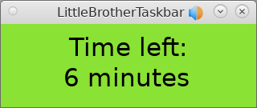
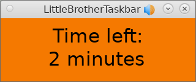

# Taskbar Tray Application for `LittleBrother`

## Overview

`LittleBrotherTaskbar` is a simple application which can be installed into the tray of the window manager
to display the remaining play time of the current user.

## Contact

Visit the project at [Facebook](https://www.facebook.com/littlebrotherdebian) or write comments 
to little-brother(at)web.de.

## Screenshots

The following screenshots show the display of `LittleBrotherTaskbar`.  

 
 

## Change History 

See [here](CHANGES.md)

## GitHub Status

 
 
 
 

## Continuous Integration Status Overview

| Status | Master | Mac OS Test | Release |
|:------ |:------ |:------------------ |:------- |
| CircleCI |  |  |  |
| Test Coverage |  |  |  | 
| Snyk Vulnerability |  | not available | not available |
| Codacy Code Quality |  | not available | not available |

Note: The vulnerability status is derived from the Python PIP packages found in `requirements.txt`.

## Features

`LittleBrotherTaskbar` has the following features:

   * Shows the status of a user monitored by [LittleBrother](https://github.com/marcus67/little_brother)

## Prerequisites

`LittleBrotherTask` requires an active installation of [LittleBrother](https://github.com/marcus67/little_brother).
The taskbar client will contact the master process of `LittleBrother`.   

## Tested Distributions

| Distribution | Version       | Comments                                                               | Most Recent Test |
| ------------ | ------------- | ---------------------------------------------------------------------- | ---------------- |
| TODO         | TODO          |                                                                        | TODO             |

## Quick Install (Debian Package)

This guide will take you through the steps required to install, configure, and run the `LittleBrotherTaskbar` 
application on your system. 

### Install the Software

`LittleBrotherTaskbar` is available as a PIP package.

### Configure the Software

In its simplest setting the tool just needs to be started with the URL of the LittleBrother master API, e.g.

    run_little_brother_taskbar --server-url=http://[HOSTNAME]:[PORT]
    
with `[HOSTNAME]` being the host where the LittleBrother master process is running and `[PORT ]` being its port.

### Troubleshooting

So, you went through all of the above but `LittleBrotherTaskbar` does not seem to work? Maybe this 
[troubleshooting page](TROUBLESHOOTING.md) can help you.

## Extended Configuration

TODO
  
## Caveats

The application `LittleBrotherTaskbar` is far from perfect. Some major caveats are listed here and/or in the 
issue list on GitHub (see [here](../issues)).

*   TODO

## Internationalization

The application uses the PIP package `Flask-Babel` to provide internationalization for the web frontend, Currently, 
the following languages are supported/prepared:

| Language | Locale | Status    | Translation provided by |
| -------- | ------ | --------- | ------------------------|
| English  | en     | Available |  Marcus Rickert         |
| German   | de     | Available |  Marcus Rickert         |
| Italian  | it     | Prepared  |  N.N.                   |
| French   | fr     | Prepared  |  N.N.                   |

Your help with translations is greatly appreciated. Please, contact the author if you are interested in providing
a translation. You do not necessarily have to clone this repository or be familiar with Python to do so.
